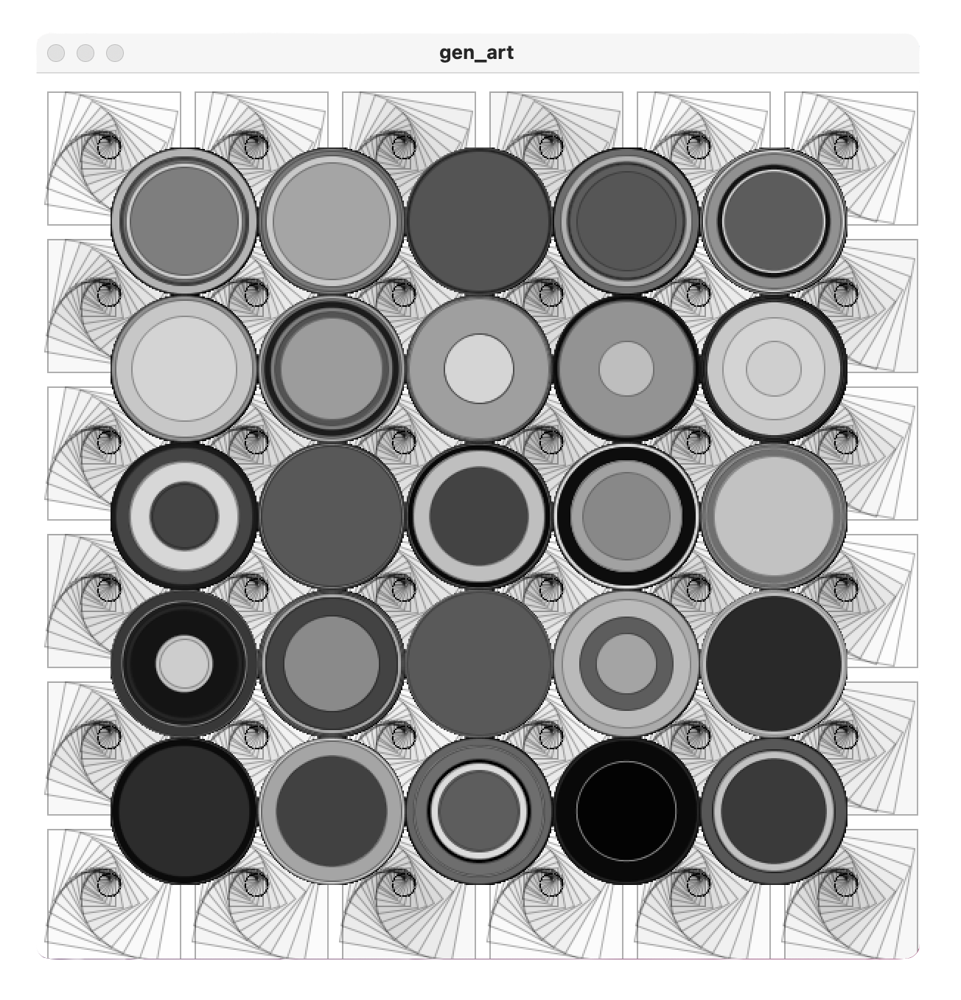

```{r setup, include=FALSE}
knitr::opts_chunk$set(echo = FALSE)
library("tm")
library("SnowballC")
library("wordcloud")
library("RColorBrewer")
library("syuzhet")
library("ggplot2")
url <- "dataset/dataset.csv"
myData <- read.csv(url)

```
## Intro
Troppe informazioni, troppo potere alla tecnologia e la velocità con cui noi assimiliamo informazioni grazie ad essa è spaventosa.
Ciò può procurare stress e ansia.
Perchè non chiedere aiuto su Reddit?
<div style="text-align:center;vertical-align:middle;">

</div>

## Le domande
- Tra i vari argomenti dei post, qual è il dominante?
- Come interpreta una macchina i vari post all'interno di un blog?
- Quali sono le parole più digitate?
- Qual è il volto dell'ansia?

## Reddit non solo un forum
Reddit è un social news aggregator, un misto di piattaforma di discussione e distributore di link, diviso in forum, i cosiddetti subreddit. Gli utenti, i redditor, sono creatori di contenuti, consumatori e curatori. Utilizzando un sistema a punti composto da upvotes e downvotes, la comunità determina quali contenuti e discussioni sono importanti: questi verranno visualizzati nella parte superiore del feed. La piattaforma è in gran parte autogestita, i moderatori fungono da guardie del forum.
<div style="text-align:center;vertical-align:middle;">

</div>

## Dataset
Un set di dati sui social media multidominio per identificare lo stress da cinque diverse categorie di comunità Reddit.

Gli argomenti dei post catturati nel dataset sono :

- anxiety
- stress
- domesticviolence
- assistance
- relationships
- survivorsofabuse
- ptsd (stress post traumatico)
- homeless

## Il progetto 
è composto dai seguenti file e directory
```{bash echo=TRUE}
ls
```
i file e le directory fondamentali sono :

- dataset - contenente i dataset da analizzare + i dataset elaborati
- gen_art - contenente lo sketch generatore + l'immagine generata
- presentation.Rmd - la presentazione in R markdown
- project.R - lo script R utilizzato per la prima stesura del codice di analisi prima dell'inserimento nella presentazione in R markdown

## Analisi Esplorativa
Una prima panoramica dei nostri dati
```{r echo=TRUE}
summary(myData)
```

str() ci dice a che categoria appartiene ognuna delle variabili, che tipo di oggetto abbiamo, il numero di casi e di variabili.
```{r echo=TRUE}
str(myData$text)
```

Ora verifichiamo la grandezza del nostro dataset
```{r echo=TRUE}
dim(myData)
```

```{r echo=TRUE}
nrow(myData)
```

```{r echo=TRUE}
ncol(myData)
```

Ora scopriamo i nomi delle variabili
```{r echo=TRUE}
names(myData)
```

E per avere un idea un po' più chiara dei dati da utilizzare 
```{r echo=TRUE}
head(myData,3)
```

```{r echo=TRUE}
tail(myData,3)
```

## Preparo il dataframe
```{r echo = TRUE , warning=FALSE}
dataForGen = data.frame(myData[, c('subreddit')])
```

```{r echo = FALSE , warning=FALSE}
save(dataForGen, file="dataForGen.RData")
load("dataForGen.RData")
```

```{r echo = TRUE , warning=FALSE}
head(dataForGen,100)
```

```{r echo = TRUE , warning=FALSE}
colnames(dataForGen)
```

## Analisi nello specifico
Tra i vari argomenti dei post, qual è il dominante?
```{r echo = FALSE , warning=FALSE}
anxiety = 0
stress = 0
domesticviolence = 0
assistance = 0
relationships = 0
survivorsofabuse = 0
ptsd = 0
homeless = 0
i = 0
```

Calcolo la frequenza degli Argomenti (programmabilità del linguaggio R)
```{r echo = TRUE , warning=FALSE}
lung = nrow(dataForGen)
for (i in lung : (i + 1)){
  if(dataForGen[i,1]=="anxiety"){anxiety = anxiety+1}
  if(dataForGen[i,1]=="stress"){stress = stress+1}
  if(dataForGen[i,1]=="domesticviolence"){domesticviolence = domesticviolence+1}
  if(dataForGen[i,1]=="assistance"){assistance = assistance+1}
  if(dataForGen[i,1]=="relationships"){relationships = relationships+1}
  if(dataForGen[i,1]=="survivorsofabuse"){survivorsofabuse = survivorsofabuse+1}
  if(dataForGen[i,1]=="ptsd"){ptsd = ptsd+1}
  if(dataForGen[i,1]=="homeless"){homeless = homeless+1}
}
```

creo la matrice e la mostro graficamente con un barplot
```{r echo = TRUE , warning=FALSE}
matrice = matrix(c(anxiety, stress, domesticviolence, assistance, relationships, survivorsofabuse, ptsd, homeless),ncol = 1
)
rownames(matrice) = c("anxiety", "stress", "domesticviolence", "assistance", "relationships", "survivorsofabuse", "ptsd", "homeless")
```

```{r echo = FALSE , warning=FALSE}
par(las=2)
barplot(matrice[,1], main="Frequenza degli argomenti", horiz=TRUE,
        names.arg=c("anxiety", "stress", "domesticviolence", "assistance", "relationships", "survivorsofabuse", "ptsd", "homeless"))
```

## Sentiment Analysis
Per procedere in maniera più veloce scarto i dati che al momento non utilizzo
```{r echo = TRUE , warning=FALSE}
write.csv(myData[, c('subreddit', 'post_id', 'text', "id", "sentiment")],'dataset/dataset_cleaned.csv')
```

Ed ora provo a rispondere alla seguente domanda
Come interpreta una macchina i vari post all'interno di un blog?
```{r echo = TRUE , warning=FALSE}
library(ggplot2)
url <- "dataset/dataset_cleaned.csv"
dati <- read.csv(url)
frame <- as.data.frame.matrix(dati)

ggplot(data = frame) + geom_point(mapping = aes(x = sentiment, y = subreddit))
```

## Text mining
Quali sono le parole più digitate?
Preparazione
```{r echo = TRUE , warning=FALSE}
write.csv(myData[, c('text')],'dataset/dataset_for_textmining.txt')
```

Importazione
```{r echo = TRUE , warning=FALSE}
# Leggo il file
text <- readLines("dataset/dataset_for_textmining.txt")
# Carico i dati
TextDoc <- Corpus(VectorSource(text))
```

Pulisco i dati
```{r echo = TRUE , warning=FALSE}
toSpace <- content_transformer(function (x , pattern ) gsub(pattern, " ", x))
TextDoc <- tm_map(TextDoc, toSpace, "/")
TextDoc <- tm_map(TextDoc, toSpace, "@")
TextDoc <- tm_map(TextDoc, toSpace, "\\|")
# Converto tutto in minuscolo
TextDoc <- tm_map(TextDoc, content_transformer(tolower))
# Rimuovo i numeri
TextDoc <- tm_map(TextDoc, removeNumbers)
# Rimuovo le stopwords in inglese
TextDoc <- tm_map(TextDoc, removeWords, stopwords("english"))
# Rimuovo le parole che non voglio analizzare
TextDoc <- tm_map(TextDoc, removeWords, c("one", "can", "see")) 
# Rimuovo la punteggiatura
TextDoc <- tm_map(TextDoc, removePunctuation)
# Rimuovo gli spazi bianchi in eccesso
TextDoc <- tm_map(TextDoc, stripWhitespace)
# Text stemming - which reduces words to their root form
TextDoc <- tm_map(TextDoc, stemDocument)
```

Preparo la matrice
```{r echo = TRUE , warning=FALSE}
TextDoc_dtm <- TermDocumentMatrix(TextDoc)
dtm_m <- as.matrix(TextDoc_dtm)
#Ordino per numero di volte in cui la parola appare
dtm_v <- sort(rowSums(dtm_m),decreasing=TRUE)
dtm_d <- data.frame(word = names(dtm_v),freq=dtm_v)
```

```{r echo = FALSE , warning=FALSE}
barplot(dtm_d[0:10,]$freq, las = 2, names.arg = dtm_d[0:10,]$word,
        col ="lightgreen", main ="Le 10 parole più usate",
        ylab = "Frequenza")
set.seed(1234)
```

```{r echo = FALSE , warning=FALSE}
set.seed(1234)
wordcloud(words = dtm_d$word, freq = dtm_d$freq, min.freq = 5,
          max.words=200, random.order=FALSE, rot.per=0.40, 
          colors=brewer.pal(8, "Dark2"))
```

L'arte della comunicazione

- Sii onesto, non provare nemmeno a barare
- Sii efficace, massimizza l'entropia delle informazioni
- Sii artistico, rendilo bello

## Generative Art
<h5>E se volessimo rispondere alla domanda qui sotto ?</h5>
<h3>Qual è il volto dell'ansia?</h3>
<h5>Potrebbe venirci in aiuto l'Arte Generativa</h5>
<div style="text-align:center;vertical-align:middle;">

</div>

```{r echo = TRUE , warning=FALSE}
#crea il dataset.csv da utilizzare con lo sketch in processing per generare un opera
write.csv(myData[, c('subreddit')],'gen_art/dataset_for_genart.csv')
```

Il file.csv viene passato ad uno sketch in processing che lo trasforma in un immagine.

## Note

- il dataset è stato scaricato da keggle ed è stato reso pubblico dall'utente con nome Ruchi Bhatia (https://www.kaggle.com/ruchi798/stress-analysis-in-social-media)
- il codice relativo alla generative art è stato parzialmente preso da un manuale di processing
- il resto delle nozioni sono state fornite dal corso di Fundamenti di Scienza dei Dati presso l'ateneo UNIUD

##
<div style="text-align:center;vertical-align:middle;">

</div>
